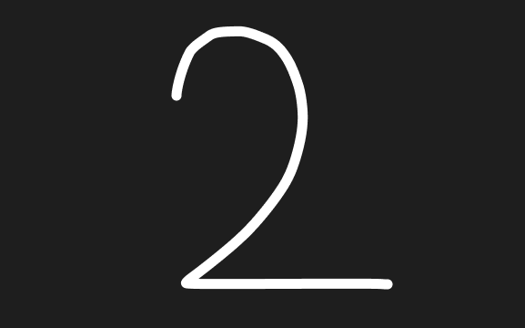

# the-two

[English](README.md)


<p>
  
</p>

> 1 + 1 を計算する、史上最も過剰に設計されたCLIツール。

## なぜ？

開発者たちは何十年もの間、`1 + 1` を手動で計算してきました。ログもなく、監査証跡もなく、エンタープライズサポートもなく。これは許されることではありません。

`the-two` は、誰も求めていない問題を、誰も必要としていないインフラで解決します。

なぜなら、`1 + 1` はもっと丁寧に扱われるべきだからです。

## クイックスタート

```bash
npx the-two
```

理解する必要はありません。ただ信じてください。

## デモ

```
[the-two] Booting addition engine v2.0...
[the-two] Seeding entropy...
[the-two] Loading constants: π, e, φ, 2 (cached)
[the-two] Selecting algorithm: naive_addition (fallbacks: quantum, enterprise)
[the-two] Warming up CPU... done (0.42s)
[the-two] Running computation...

┌─ Computation Trace ────────────────────
│ input.a = 1
│ input.b = 1
│ operation = ADD
│ safety = ON
│ integrity = VERIFIED
└───────────────────────────────────────

✨ Result: 2
```

## モード

| フラグ | モード | 何が起きるか                           |
|-------|--------|----------------------------------|
| *(なし)* | デフォルト | 本格的っぽい演算ログが流れる                   |
| `--verbose` | 詳細 | 不必要に丁寧な7ステップの計算過程                |
| `--quantum` | 量子 | シュレディンガーモード。観測するまで答えは不確定         |
| `--enterprise` | エンタープライズ | 分散クラスタ128台、タイムアウト、リトライ、結局ローカルで計算 |
| `--silent` | サイレント | `2` とだけ出力。ミニマリスト向け               |

```bash
npx the-two --enterprise
```

```
[enterprise] Booting distributed addition cluster...
[enterprise] Region: ap-northeast-1
[enterprise] Scaling nodes... (x128)
[enterprise] Connecting to addition-service...
[enterprise] ERROR: timeout
Retrying... (1/3)
Retrying... (2/3)
Retrying... (3/3)

[enterprise] Fallback to local computation

2
```

## API

プログラムから `2` が必要な方へ：

```js
import { justTwo, add } from "the-two";

justTwo(); // => 2（答え。常に。）
add(1, 1); // => 2（1つ目を信じられなかった方向け）
```

### `justTwo()`

`2` を返します。引数なし。オプションなし。疑う余地なし。

### `add(a, b)`

2つの数値の合計を計算します。技術的には `1` と `1` 以外の入力もサポートしていますが、なぜそんなことを？

## ベンチマーク

| 手段 | 時間 | 正確性 | エンタープライズ対応 | 量子安全 |
|-----|------|--------|-------------------|---------|
| 暗算 | ~0.1秒 | だいたい | いいえ | いいえ |
| 電卓 | ~1秒 | はい | いいえ | いいえ |
| Python | ~0.3秒 | はい | いいえ | いいえ |
| Excel | ~3秒 | 場合による | 議論の余地あり | いいえ |
| **the-two** | **~1秒** | **常に** | **はい** | **はい** |
| **the-two --enterprise** | **~3秒** | **最終的には** | **もちろん** | **はい** |

## FAQ

**引き算はサポートしていますか？**
いいえ。スコープクリープは優れたソフトウェアの敵です。

**本番環境で使えますか？**
初日から本番対応しています。問題は、使用する側に準備ができているかどうかです。

**電卓を使えばよくないですか？**
電卓に量子モードはありますか？

**これ、ネタですか？**
ネタなのは、エンタープライズ基盤なしで `1 + 1` を計算することの方です。

## 特徴

- **依存関係ゼロ** — このプロジェクトで唯一、過剰設計されていない部分
- **エンタープライズグレードの加算** — ついに、`1 + 1` にふさわしいインフラが
- **量子安全な計算** — 未来は不確定ですが、`2` は確定です
- **TypeScript** — ジョークにも型安全を
- **テスト通過率100%** — 正直、逆に怪しい

## ライセンス

MIT — ご自由にお使いください。エンタープライズサポートなしで足し算した結果については一切責任を負いません。
